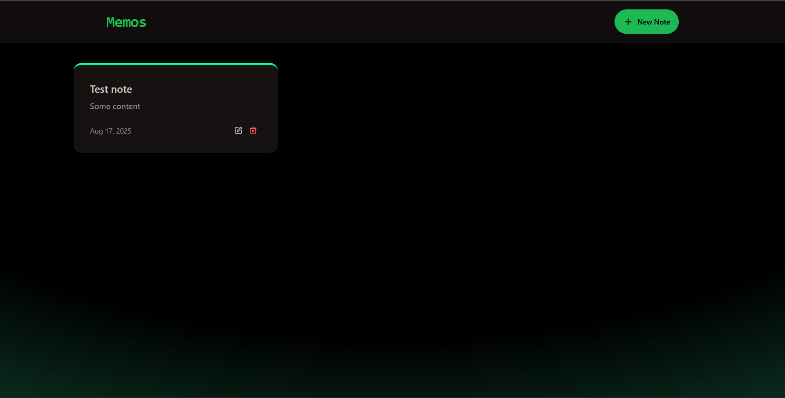

# Memos

A full-stack note-taking application built with React (frontend) and Express/MongoDB (backend).

---

## Live Demo

Check out the deployed app:  
[https://memos-randum.netlify.app/](https://memos-randum.netlify.app/)

---

## Screenshot



---

## Features

- Create, view, update, and delete notes
- Responsive UI with Tailwind CSS and DaisyUI
- RESTful API with Express and MongoDB
- Toast notifications for user feedback

---

## Project Structure

```
memos/
├── backend/
│   ├── src/
│   │   ├── config/
│   │   ├── controllers/
│   │   ├── models/
│   │   ├── routes/
│   │   └── server.js
│   └── package.json
├── frontend/
│   ├── src/
│   │   ├── components/
│   │   ├── lib/
│   │   ├── pages/
│   │   ├── App.jsx
│   │   ├── main.jsx
│   │   └── index.css
│   ├── public/
│   ├── index.html
│   ├── package.json
│   └── tailwind.config.js
├── package.json
└── README.md
```

---

## Getting Started

### Prerequisites

- Node.js (v18+ recommended)
- npm
- MongoDB database (local or cloud, e.g. [MongoDB Atlas](https://www.mongodb.com/atlas))

### 1. Clone the repository

```sh
git clone https://github.com/amitkks/memos.git
cd memos
```

### 2. Setup Backend

```sh
cd backend
cp .env.example .env   # Create your .env file with MONGO_URI and PORT
npm install
npm run dev            # Starts backend on http://localhost:5001
```

**.env example:**
```
MONGO_URI=your_mongodb_connection_string
PORT=5001
NODE_ENV=development
```

### 3. Setup Frontend

```sh
cd ../frontend
cp .env.example .env   # Create your .env file with VITE_PROD_URL and VITE_NODE_ENV
npm install
npm run dev            # Starts frontend on http://localhost:5173
```

**.env example:**
```
VITE_PROD_URL=https://your-production-backend-url/api
VITE_NODE_ENV=development
```

---

## Build & Deploy

- To build the frontend for production:
  ```sh
  npm run build --prefix frontend
  ```
- The backend can serve the frontend build in production mode.

---

## API Endpoints

- `GET    /api/notes`         - Get all notes
- `GET    /api/notes/:id`     - Get a single note
- `POST   /api/notes`         - Create a new note
- `PUT    /api/notes/:id`     - Update a note
- `DELETE /api/notes/:id`     - Delete a note

---

## Technologies Used

- **Frontend:** React, Vite, Tailwind CSS, DaisyUI, Axios, React Router, Lucide Icons
- **Backend:** Express, MongoDB, Mongoose, CORS, dotenv

---

## License

[ISC](LICENSE)

---
